<div align="center">


**Plug-and-play MCP. UI superpowers for your agent.**

[](https://www.npmjs.com/package/@pymodel/designer-skill-mcp)
[](https://www.npmjs.com/package/@pymodel/designer-skill-mcp)
[](https://github.com/PyModel/designer-skill/actions/workflows/test.yml)
[](LICENSE)
[](https://skills.sh/pymodel/designer-skill)
<br />
[](#tools)
[](#references)
[](#tools)
[](designer-skill-mcp/package.json)
[](#setup)

[Setup](#setup) · [How it works](#how-it-works) · [References](#references) · [Tools](#tools) · [Development](#development)

</div>

## Setup

[](#setup)

**Paste into your agent** (Claude Code, Codex, Cursor, any MCP client). It installs the skill, wires the MCP and verifies the tools:

```text
Add designer-skill alongside Niblet Designer UI. It is optional and keyless: it routes a design request, loads the right reference, and gates the ship. Niblet supplies the real screens and materials.

1. Install or refresh the skill into the user skill directory (not this project):
npx skills add PyModel/designer-skill --skill designer-skill -g -y

2. Add the local MCP using this client's native MCP configuration, in the user-level (not project-level) config:
Name: designer-skill
Transport: stdio
Command: npx
Args: -y @pymodel/designer-skill-mcp@latest

No API key is needed. Do not add one.

3. Verify: list the designer-skill server's tools and confirm get_preflight_brief, dispatch_intent, review_and_gate are present. Do not run a sample check.

When setup is complete, confirm that the designer-skill skill is installed and that the three tools are exposed. On UI work from now on: call get_preflight_brief first, use dispatch_intent to load only the references it recommends, pull screen references and materials from the niblet server, then call review_and_gate on the changed files before saying the work is done. If there is an active UI task, continue it. Otherwise say: "designer-skill is ready and paired with Niblet."
```

No Niblet? Drop the "pull screen references and materials from the niblet server" clause.

**Or pick one:**

| | Install |
|---|---|
| 🟣 **Claude Code plugin** (skill + MCP) | `/plugin marketplace add PyModel/designer-skill` then `/plugin install designer-skill@pymodel` |
| 🟢 **Codex plugin** | `codex plugin marketplace add PyModel/designer-skill`, then install **designer-skill** from **pymodel** in `/plugins` |
| ⚫ **Cursor plugin** | Install from the marketplace; ships `mcp.json`, skills, `/designer-setup` · `/designer-status` |
| 🔵 **MCP only, any client** | `claude mcp add designer-skill -- npx -y @pymodel/designer-skill-mcp` (same args for `codex mcp add`, `pythinker mcp add --transport stdio`) |
| 🟠 **Skill only** | `npx skills add PyModel/designer-skill --skill designer-skill` or copy `skills/designer-skill/` into `~/.claude/skills/` / `~/.codex/skills/` |

Canonical MCP config ([`mcp.json`](mcp.json)):

```json
{ "mcpServers": { "designer-skill": { "command": "npx", "args": ["-y", "@pymodel/designer-skill-mcp@latest"] } } }
```

`@latest` tracks npm; teams pin `@pymodel/designer-skill-mcp@0.18.1`. Plugin skill content updates separately (`/plugin update …`). MCP registry name: `io.github.PyModel/designer-skill-mcp`. Requires Node 22+.

<details>
<summary><strong>Per-client config</strong> (VS Code, Codex TOML, Kilo, Open Code, Claude Desktop, Pythinker, Pi)</summary>

**VS Code** `.vscode/mcp.json` (1.99+):

```json
{ "servers": { "designer-skill": { "type": "stdio", "command": "npx", "args": ["-y", "@pymodel/designer-skill-mcp"] } } }
```

**Codex CLI** `~/.codex/config.toml`:

```toml
[mcp_servers.designer-skill]
command = "npx"
args = ["-y", "@pymodel/designer-skill-mcp"]
```

**Open Code** `opencode.json`:

```json
{ "mcp": { "designer-skill": { "type": "local", "command": ["npx", "-y", "@pymodel/designer-skill-mcp"] } } }
```

**Claude Desktop, Cursor (`.cursor/mcp.json`), Kilo Code (`mcp_settings.json`), Pythinker (`~/.pythinker/mcp.json`)**: the canonical `mcpServers` JSON above. Pythinker verify: `pythinker mcp test designer-skill` ([guide](docs/blog/integrating-designer-skill-with-pythinker.md)).

**Pi**: the same JSON, or register the skill natively: `{ "skills": [{ "path": "/path/to/skills/designer-skill/SKILL.md" }] }`

**Local checkout**: replace `npx` with `"command": "node", "args": ["/abs/path/to/designer-skill-mcp/dist/index.js"]`.

</details>

## How it works

```mermaid
flowchart LR
  A[Prompt] --> B[get_preflight_brief]
  B --> C[dispatch_intent]
  C --> D[get_reference]
  D --> E[Build / polish UI]
  E --> F[review_and_gate]
  F -->|FAIL: fix| E
  F -->|static checks pass| G[Rendered checks<br/>by the host]
  classDef start fill:#f8fafc,stroke:#94a3b8,color:#18181b
  classDef route fill:#eff6ff,stroke:#3b82f6,color:#1e3a8a
  classDef know fill:#faf5ff,stroke:#7c3aed,color:#4c1d95
  classDef work fill:#fff7ed,stroke:#e87a3d,color:#7c2d12
  classDef gate fill:#ecfdf5,stroke:#10b981,color:#065f46
  classDef host fill:#fff1f2,stroke:#e11d48,color:#881337
  class A start
  class B,C route
  class D know
  class E work
  class F gate
  class G host
```

[](#how-it-works)



| 🔵 Route | 🟣 Know | 🟢 Check |
|---|---|---|
| `dispatch_intent` maps "make it pop" or "it feels off" to design verbs and at most four references. | 15 designer references (type, color, motion, a11y, anti-slop, redesign) plus 26 `ux/*` references (forms, collaboration, canvas, AI, i18n…). | A 44-rule deterministic detector backs `review_and_gate`, which reports each required rule as ran, unsupported, unresolved or waived. |

The gate is static only: overall status is `FAIL` or `NOT_VERIFIED`, never a rendered-readiness pass. Rendered, accessibility and performance checks stay `NOT_RUN` until the host supplies evidence.

**Example:** *"Use designer-skill to redesign this pricing page without breaking functionality."* → `get_preflight_brief` → `dispatch_intent` → `get_reference` → edit → `review_and_gate`.

<div align="center">

**Built with it:** [pythinker.com](https://pythinker.com)

<a href="https://pythinker.com"></a>

</div>

## References

[](#references)

| File | Use when | Tier |
|---|---|---|
| `design-principles` | Typography, spacing, color, layout, hierarchy | 🔵 core |
| `differentiation-playbook` | Being distinctive: inverse test, layout menu, named references | 🔵 core |
| `aesthetic-systems` | Picking a look: 5 systems with palettes, fonts, shadows | 🔵 core |
| `motion-and-interaction` | Timing, springs, scroll, reduced motion | 🔵 core |
| `engineering-and-performance` | Tokens, a11y, responsive, Core Web Vitals | 🔵 core |
| `avoid-ai-slop` | Ban list, category-reflex checks, completeness contract | 🔵 core |
| `refactor-and-redesign` | Audit → diagnose → redesign without breaking behavior | 🔵 core |
| `command-playbook` | Intent → verb dispatch | 🔵 core |
| `interaction-design` | Fitts/Hick/Miller, forms, navigation, errors, loading | 🔴 extended |
| `visual-critique` | Seven-dimension critique | 🔴 extended |
| `design-systems` | Token architecture, component specs, theming | 🔴 extended |
| `project-init` | Discovery interview, PRODUCT.md, DESIGN.md | 🔴 extended |
| `craft-flow` | Shape-then-build pipeline with user gates | 🔴 extended |
| `live-mode` | Browser variant mode: select, HMR, steer, accept | 🔴 extended |
| `css-techniques` | Modern CSS: container queries, `:has()`, `clamp()`, logical props | 🔴 extended |

Plus 26 `ux/*` references in [`skills/ux-designer/`](skills/ux-designer/).

| Phrase | Verbs | Reads |
|---|---|---|
| "make it pop" | `amplify` · `color` | `aesthetic-systems`, `design-principles` |
| "it feels off" | `check` · `layout` | `refactor-and-redesign`, `avoid-ai-slop` |
| "production-ready" | `ship` · `check` | `engineering-and-performance` |
| "add some motion" | `motion` | `motion-and-interaction` |
| "it looks AI-made" | `review` · `brand` | `avoid-ai-slop`, `aesthetic-systems` |
| "redesign this" | `check` · `refresh` | `refactor-and-redesign`, `command-playbook` |

## Tools

[](#tools)

<!-- tools:start -->
| Tool | Purpose |
|---|---|
| `get_preflight_brief` | Scope and verification contract (call first) |
| `load_project_context` | Read PRODUCT.md / DESIGN.md from the project (absolute `cwd`) |
| `get_design_system` | SKILL.md router and reference map |
| `get_reference` | One of 41 references by name (designer or `ux/*`) |
| `anti_slop_checklist` | Advisory style and truthful-content review guidance |
| `list_commands` | All design verbs with descriptions |
| `get_command` | Help and reference names for one verb |
| `dispatch_intent` | Map a request → verb(s) + at most four references to read |
| `commit_design_direction` | Validate a context-grounded direction record |
| `get_palette_seed` | OKLCH brand seed for authorized new palette work |
| `detect_antipatterns` | Deterministic static scan (44 rules): coverage, file hashes, gaps |
| `review_and_gate` | Static gate per required rule; never claims rendered readiness |
| `find_ui_references` | Optional niblet real-screen search (`NIBLET_TOKEN`) |
| `get_design_reference` | Optional niblet structured reference (`NIBLET_TOKEN`) |
<!-- tools:end -->

**Resources:** `designer://skill` · `designer://reference/{+name}` · **Prompt:** `design` (`task`, optional `aesthetic`)

## Development

[](#development)

```bash
cd designer-skill-mcp
npm ci
npm run build   # syncs skills/ → assets/, compiles TypeScript
npm test        # vitest; `npm run smoke` installs the packed tarball and drives it
```

**HTTP mode** (Streamable HTTP at `/mcp`):

```bash
node dist/index.js --http --port 3017 --root /abs/project                     # 127.0.0.1
DESIGNER_SKILL_HTTP_TOKEN=… node dist/index.js --http --host 0.0.0.0 --root /abs/project
```

Loopback binds validate the Host header. A non-loopback bind requires `DESIGNER_SKILL_HTTP_TOKEN` (`Authorization: Bearer …`) and at least one `--root`.

**Release:** `./scripts/release.sh "notes"` bumps and syncs every version, verifies, tags and pushes; [`publish.yml`](.github/workflows/publish.yml) publishes npm (with provenance), the MCP registry entry and the GitHub release. Contract details: [`docs/HARDENING.md`](docs/HARDENING.md).

<div align="center">

[](LICENSE)
[](designer-skill-mcp/)
[](skills/designer-skill/)

</div>
