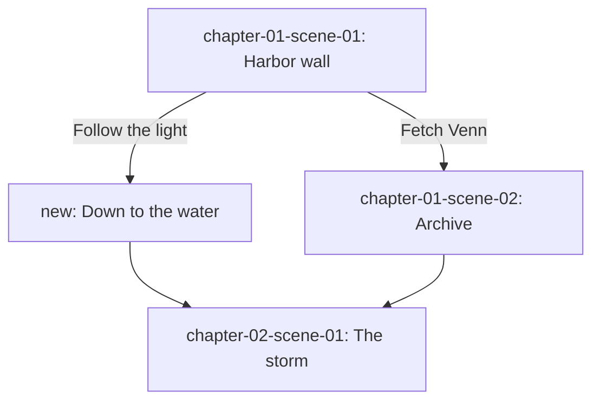

# Interactive Fiction

The story project is linear: one sequence of chapters and scenes. An
interactive version keeps the project as its source and lives in
`adaptations/interactive/`, written for a tool such as Ink or Twine.

## Branch Map From Scenes

1. List the scenes in reading order. Each scene record is a candidate
   node; its `characters`, `location`, and `state-changes` are the state
   the node sets.
2. Find decision points: scenes whose `outcome` is `yes-but` or `no-and`,
   sequel units with a `dilemma`, and any moment where a character makes a
   choice the reader could make instead.
3. For each decision, write the options and where each goes: an existing
   scene (the canonical path), a new scene, or a rejoin point.
4. Record every piece of state a choice sets (a flag, a relationship, an
   item) and every later node that reads it.

Save `adaptations/interactive/branch-map.md`:

````markdown
---
type: branch-map
story: {story-id}
tool: ink
updated: YYYY-MM-DD
---

# Branch Map: {Title}



## State

| Variable | Set by | Read by |
|----------|--------|---------|
| trusted_venn | archive | chapter-04 choice |
````

Mermaid renders on GitHub and in many editors. `story diagram` draws the
story's own graphs (relationships, locations, timeline, clues, arcs); the
branch map is written by hand.

## Branching Structures

Choose with the author; mixing is normal.

- **Branch and bottleneck:** paths split, then rejoin at key story
  events. Keeps writing manageable; state carries the differences.
- **Gauntlet:** a mostly linear path where wrong choices end early or
  loop back.
- **Time cave:** every choice branches for good. Explodes in size; best
  for short pieces.
- **Sorting hat:** early choices decide which of a few long, mostly
  linear routes the reader takes.
- **Open map or hub:** the reader moves between locations in any order;
  a good fit when the location records have `routes`.
- **Quality-based:** choices raise or lower stats that color later
  scenes instead of branching them.

Every choice should be meaningful (different consequence or expression),
informed (the reader can guess what it means), and acknowledged (the
story reacts, even briefly).

## Ink

Ink (by inkle) is a text-first scripting language, compiled with inklecate
or the Inky editor, and playable on the web or in game engines.

```ink
VAR trusted_venn = false

=== harbor_wall ===
Mara climbs the wall. Below, a second light burns on the water.
* [Follow the light] -> down_to_the_water
* [Fetch Venn]
    ~ trusted_venn = true
    -> archive

=== down_to_the_water ===
The steps are slick. {trusted_venn: Venn would have warned her.}
-> the_storm

=== archive ===
Venn is still awake.
-> the_storm

=== the_storm ===
The storm hits before either of them can speak.
-> END
```

| Syntax | Meaning |
|--------|---------|
| `=== knot ===` | A section (node) |
| `= stitch` | A sub-section inside a knot |
| `* [Choice]` | A choice that disappears once used; `+` keeps it available |
| `-> target` | Divert to a knot or stitch; `-> END` ends the story |
| `VAR name = value`, `~ name = value` | Declare and set a variable |
| `{flag: text}` | Show text only when the condition holds |
| `- ` | A gather point where branches rejoin |

## Twine

Twine is a visual passage editor that publishes to a single HTML file. Its
text format, Twee, can be kept in version control and compiled with
Tweego. Story formats (Harlowe, SugarCube, Chapbook) differ in macro
syntax; pick one and stay with it.

```twee
:: StoryTitle
The Last Ember

:: Harbor Wall
Mara climbs the wall. Below, a second light burns on the water.

[[Follow the light->Down To The Water]]
[[Fetch Venn->Archive]]

:: Archive
(set: $trustedVenn to true)
Venn is still awake.
[[Go->The Storm]]
```

(The macro line is Harlowe; SugarCube writes `<<set $trustedVenn to
true>>`.) Save as `adaptations/interactive/{story-id}.twee`.

## Checks

- [ ] Every node reachable; every path reaches an ending or a bottleneck
- [ ] Every variable set is read somewhere, and every read is set first
- [ ] The canonical path reproduces the book's events
- [ ] New scenes agree with the bible: character states, deaths, and
      locations from the story project still apply unless a branch
      deliberately changes them
